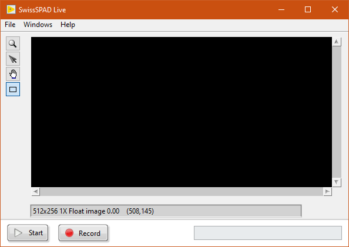
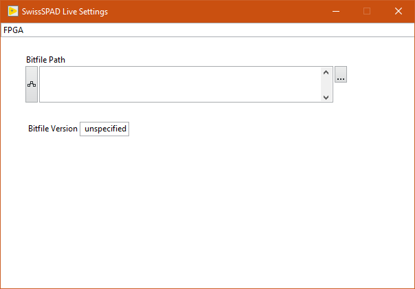
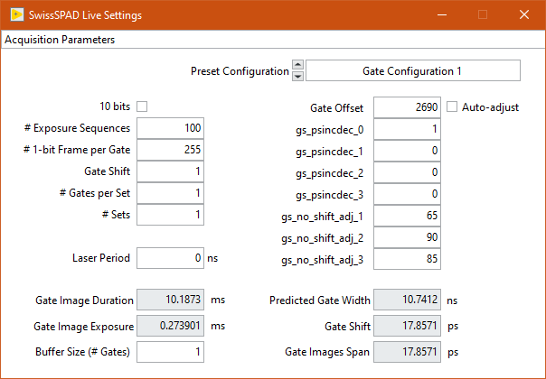
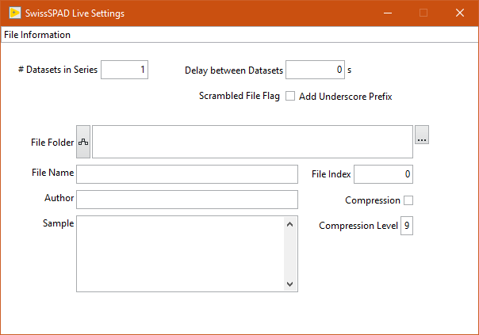
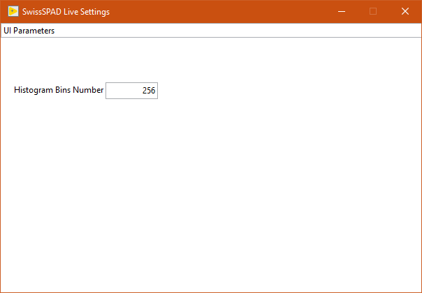
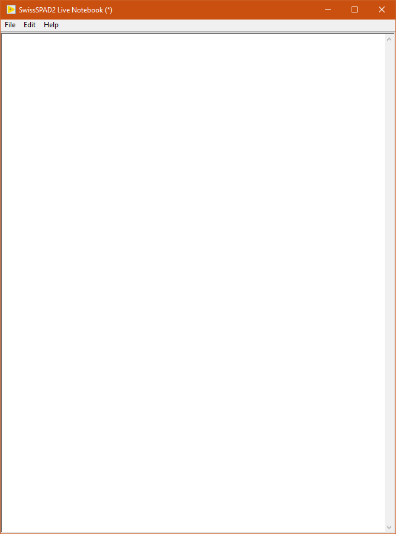
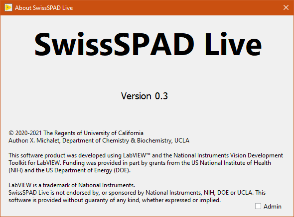

Windows
=======

SwissSPAD Live is comprised of one main Window and 5 child windows accessible from the top ``Windows`` menu. These different windows are briefly described next. For further information, please check the User Guide.

.. _main-window:

Main Window
-----------

The main window displays the latest live or recorded image in the top part.

The top menu bar gives access to the following functions:

- File
	- Quit

- Windows
	- Settings (``Ctrl+E``)
	- Histogram (``Ctrl+M``)
	- Notebook (``Ctrl+N``)
	
- Help
	- Show Context Help (``Ctrl+H``)
	- FPGA Status
	- Reset FPGA
	- About

The center part displays the last processed image. This object is interactive (use the right-click menu to access the diffferent functions). In particular, it is possible to zoom in (zoom tool + left click) and out (zoom tool + Shift + left click). The rectangular ROI can be used to defined which subregion of the detector to save data from (see Settings >> Image Information).

The bottom part contains the ``Live`` and ``Record`` buttons, as well as a ``Message Box`` in which information on the current on-going task is displayed.

During processing, an animated busy icon appears to the right of the Record button. In those occations, some of the user inputs are queued until the current task is completed (some others such as opening windows are still processed).

During data saving, a blinking LED appears within the busy icon. This is a reminder that while data acquisition might have completed, asynchronous data saving is still taking place. To obtain information on this (or these) process(es), hover over the LED and check the information displayed in the :ref:`Context Help Window <context-help-window>`.

Right-clicking on the LED gives access to the ``Abort All Saving Tasks`` option. To use this nuclear option, first stop the current recording task.

The main window is resizeable, its minimum size ensuring that the displayed image's size (scale 1) is 512 x 256 pixel.

.. _settings-window:

Settings  Window
----------------

The Settings window is accessed via the ``Windows >> Settings`` menu item (shortcut: ``Ctrl+E``).

The window consists of several tabs which can be accessed from the top pull-down selector: :ref:`FPGA <FPGA-tab>`, :ref:`Acquisition Parameters <acquisition-parameters-tab>`, :ref:`Image Parameters <image-parameters-tab>`, :ref:`File Information <file-information-tab>` and :ref:`UI Parameters <UI-parameters-tab>`.

.. _FPGA-tab:

FPGA
^^^^
 

The FPGA tab is used to specify which bitfile to upload to the FPGA (and therefore which task the detector can subsequently  perform).

There are typically two types of available bitfile for each FPGA: an ``intensity`` bitfile and a "gated" one. The former ignores all gate settings (see next tab description), keeping the gate open during the whole 1-bit frame integration time, and is typically used for live mode imaging (e.g. for focus adjustment).

The latter is used for time-gated data acquisition. It can of course also be used in live mode, but in that case, the gate position is fixed to the starting value defined in the :ref:`Acquisition Parameters <acquisition-parameters-tab>` tab.

Check the ``Auto Reset FPGA`` checkbox to let the software automatically reset the FPGA during acquisition in case of time out, and repeat the failed recording.

.. _acquisition-parameters-tab:

Acquisition Parameters
^^^^^^^^^^^^^^^^^^^^^^

The Acquisition Parameters tab is used to specify gate parameters as well as the number of gates and their exposure, etc. Gray-background parameter values are display only and are updated automatically when the user modifies other parameters.

Please check the :ref:`User Guide section <setting-acquisition-parameters>` for a detailed description of the different parameters.

.. _image-parameters-tab:

Image Parameters
^^^^^^^^^^^^^^^^

.. image:: image/SS2-Live-Settings-Window-Image-Parameters.PNG

The Image Parameters tab is used to specify whether or not:

- only a region of interest (ROI) of the frame is saved,

- define the ROI (user defined by numerical values or as drawn on the main window image),

- data is binned before being saved.

Note that while using a ROI or binning the data results in smaller files, the data acquisition process still uses the full sensor frame, image cropping and binning occuring in ssoftware before data saving. In other words, the data acquisition time is independent of these settings. The additional data processing involved is usually minimal. However, data saving can be considerably sped up, and the data footprint reduced accordingly.

Also keep in mind that once cropped or binned, the original data cannot be recovered.

.. _file-information-tab:

File Information
^^^^^^^^^^^^^^^^

The File Information tab is used to define the file path, start index, etc. and additional information about the recorded data file(s), as detailed next.

- ``# Datasets in Series`` (default: 1) specifies the number of times the preset acquisition is repeated, one file being saved after each acquisition, its index starting at the current ``File Index`` value + 1 and being incremented by 1 for each new file.

- ``Delay between Datasets`` (default: 0 s) can be used to add a pause after each dataset acquisition.

- ``Add Underscore Prefix`` (default: false) can be used to easily identify files which have been identifed as comprising data that was scrambled during transfer from FPGA, or comprising less gates than requested.

- ``File Folder`` specifies which folder the files are saved into. Use the Browse button (3 dots) to the right to select the target folder.

- ``File  Name`` represents the root file name, to which ``_n.hdf5`` will be added, where ``n`` is the value of ``File Index``, displayed as a 4-digit number (zero-justified).

- ``Compression``: if checked, each time-gate image stored in the final HDF5 file is compressed using the zlib compression algorithm.

- ``Compression Level`` (0 - 9, default: 9): Compression adds to the data saving duration, but can reduce the final file size severalfold, depending on the gate image complexity. In general, file saving starts becoming slower than data acquisition for compression level 7 and above, while the additional file size reduction is minimal.

- ``Author``, ``Sample``: non-mandatory fields used to document the file.

.. _UI-parameters-tab:

UI Parameters
^^^^^^^^^^^^^

The UI Parameters tab is currently only used to define the number of bins used for the image histogram.

Note that ``Histogram Bin Number`` defines the number of bins into which the full range of the gate image pixels is divided. For instance, to have bins of width 1, used ``256`` for a 8-bit image, and ``1020`` for a 10-bit image.

.. _notebook-window:

Notebook
--------

The Notebook is a Rich Text Box object in which most actions performed by the software are recorded. It is accessed via the ``Windows >> Notebook`` menu item (shortcut: ``Ctrl+N``).

It can also be used to type in user comments, copy/paste text or graphics, etc. and in general is intended as a log of an experimental session.

The content of the Notebook can be saved (and re-opened within the Notebook) as a rich text format (.rtf) file.

.. _histogram-window:

Histogram Window
----------------

.. image:: image/SS2-Live-Histogram-Window.PNG

The Histogram Window shows an histogram of the displayed image's pixel values. It is accessed via the ``Windows >> Histogram`` menu item (shortcut: ``Ctrl+M``). The number of bins of the histogram is defined in the Settings >> :ref:`UI Parameters <UI-parameters-tab>` tab.

The Histogram window is resizable.

.. _context-help-window:

Context Help Window
-------------------

.. image:: image/SS2-Live-Help-Window.PNG

The Context Help window is a floating window and shows information (when available) about the object the mouse is over. It is shown or hidden using the ``Help >> Show Context Help`` menu item (shortcut: ``Ctrl+H``).

.. _about-window:

About Window
------------

The About Window is a dialog window (it prevents other windows from being interacted with). Click anywhere in it to close it.
