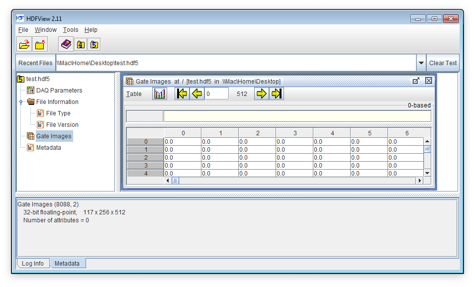

.. _alligator-hdf5-file-format:

AlliGator HDF5 File Format
==========================

It is possible to save data loaded in AlliGator (and reload them!) in a file format based on the HDF5 hierarchical format developed and maintained by the HDF Group.
This page briefly describes the file format used by AlliGator. Note that the latest AlliGator version supports all previous HDF5 file format versions.

v 0.7 (2023-09-02)
++++++++++++++++++

This version adds adds new information to the *SwissSPAD Detector Information* ``group``. and a new parameter to the 
*DAQ Parameters* cluster (and renames some of the parameters).

+ The SwissSPAD-detector specific ``group``, *SwissSPAD Detector Information*, is comprised of 8 ``strings`` and three 
   Boolean flags (stored as integers) as shown below:

+---------------------------+-----------------+--------------------------------------------------------------------------+
| Parameter Name            | Type            | Parameter Description                                                    |
+===========================+=================+==========================================================================+
+ Sensor Type               | String          | 2 types are currently supported: ``SS2`` and ``SS3``                     |
+---------------------------+-----------------+--------------------------------------------------------------------------+
+ Microlens                 | Boolean [1]     | Specifies whether the detector is equipped with microlenses              |
+---------------------------+-----------------+--------------------------------------------------------------------------+
+ Detector PCB Version      | String          | 4 types are currently supported, namely ``unknown``, ``SS2 PCB1``,       |
+                           |                 | ``SS2 PCB2``, ``SS3 PCB1``                                               |
+---------------------------+-----------------+--------------------------------------------------------------------------+
| Bottom Half               | Boolean [1]     | Specifies whether the bottom half was used                               |
+---------------------------+-----------------+--------------------------------------------------------------------------+
| Bottom FPGA Serial Number | String          | as obtained from the Opal Kelly API                                      |
+---------------------------+-----------------+--------------------------------------------------------------------------+
| Bottom Bitfile Path       | String          | Path of the bitfile used during acquisition                              |
+---------------------------+-----------------+--------------------------------------------------------------------------+
| Bottom Bitstream Version  | String          | as obtained from the bitfile header                                      |
+---------------------------+-----------------+--------------------------------------------------------------------------+
| Top Half                  | Boolean [1]     | Specifies whether the bottom half was used                               |
+---------------------------+-----------------+--------------------------------------------------------------------------+
| Top FPGA Serial Number    | String          | as obtained from the Opal Kelly API                                      |
+---------------------------+-----------------+--------------------------------------------------------------------------+
| Top Bitfile Path          | String          | Path of the bitfile used during acquisition                              |
+---------------------------+-----------------+--------------------------------------------------------------------------+
| Top Bitstream Version     | String          | as obtained from the bitfile header                                      |
+---------------------------+-----------------+--------------------------------------------------------------------------+

+ The *DAQ Parameters* ``cluster`` (saved as a Table):

+---------------------------+----------+--------------------------------------------------------------------------+
| Parameter Name            | Unit     | Parameter Description                                                    |
+===========================+==========+==========================================================================+
| # Pixel X                 |          | number of pixels in the horizontal direction                             |
+---------------------------+----------+--------------------------------------------------------------------------+
| # Pixel Y                 |          | number of pixels in the vertical direction                               |
+---------------------------+----------+--------------------------------------------------------------------------+
| # Gates                   |          | number of time points in the recorded decays                             |
+---------------------------+----------+--------------------------------------------------------------------------+
| # Datasets                |          | for time-series, number of time points. The default is a single dataset  |
+---------------------------+----------+--------------------------------------------------------------------------+
| Gate Image Exposure       |    s     | Time during which photon are accumulated. For time-gated                 |
|                           |          | acquisition, this corresponds to a fraction (duty cycle) of the actual   |
|                           |          | camera integration per gate.                                             |
|                           |          | For a TCSPC dataset, this correspond to the pixel dwell time             |
+---------------------------+----------+--------------------------------------------------------------------------+
| Macrotime Gate Separation |    s     | time separation between gate acquisition in "laboratory" time (macrotime)|
|                           |          | For instance, in a camera-based acquisition, this time could be equal to |
|                           |          | the Exposure/Gate (s) parameter (if readout is performed while the next  |
|                           |          | gate is being acquired), or longer (if readout adds a delay until the    |
|                           |          | next gate image is acquired. For TCSPC data, this value will typically   |
|                           |          | be 0. When this information is unavailable, it takes the value ``NaN``   |
|                           |          | (not a number)                                                           |
+---------------------------+----------+--------------------------------------------------------------------------+
| Nanotime Gate Separation  |    s     | Separation between the starting point of consecutive gates. For TCSPC    |
|                           |          | data, this is equal to the Gate Duration (s) parameter described below.  |
|                           |          | For a camera-based acquisition, this is the user-specified gate shift    |
+---------------------------+----------+--------------------------------------------------------------------------+
| Gate Width                |    s     | Time during which photons are detected after each laser pulse. For TCSPC |
|                           |          | data, this quantity is identical to the Nanotime Gate Separation (s)     |
|                           |          | parameter above and corresponds to the TCSPC bin size. For a camera-based|
|                           |          | time-gated acquisition, this will usually be a much larger value         |
|                           |          | (typically seveal 100 ps to several ns)                                  |
+---------------------------+----------+--------------------------------------------------------------------------+
| Laser Period              |    s     | Laser Period used during acquisition                                     |
+---------------------------+----------+--------------------------------------------------------------------------+
| SYNC Period               |    s     | Sync pulse period used to trigger the recording. This will typically be  |
|                           |          | equal or larger than (multiple of) the laser period, such as for a       |
|                           |          | TAC/TDC window duration                                                  |
+---------------------------+----------+--------------------------------------------------------------------------+
| Gate Image Integration    |    s     | integration time needed to acquire a single gate image. For time-gated   |
|                           |          | acquisition, this is generally larger than the gate exposure.            |
|                           |          | For a TCSPC dataset, this correspond to the pixel dwell time             |
+---------------------------+----------+--------------------------------------------------------------------------+

v 0.6.1 (2022-07-27)
++++++++++++++++++++

This minor version adds a new field (*Dataset Timestamp*, a double-precision floating point number) to the *File Information* ``group``.

This parameter (unit: s) records the start of the recording of the dataset in the file (in a laboratory clock).

v 0.6 (2022-04-13)
++++++++++++++++++

This version supports multiple gate images per gate step (as is necessary for the SwissSPAD3 detector).

One new field (*Gate Names*, a string array) has been added to the *File Information* ``group``, resulting in the following structure:

+ *File Information* ``group`` containing 9 ``strings``, 1 ``string array``, 2 ``integers`` and 1 ``Boolean``:

+---------------------------+-----------------+--------------------------------------------------------------------------+
| Parameter Name            | Type            | Parameter Description                                                    |
+===========================+=================+==========================================================================+
+ File Type                 | String          | currently, a single file type is recognized, named Wide-Field Time-Gated +
+                           |                 | Data                                                                     |
+---------------------------+-----------------+--------------------------------------------------------------------------+
+ File Version              | String          | for a file compliant with this version, the string would be 0.5          |
+---------------------------+-----------------+--------------------------------------------------------------------------+
| Gate Names                | String Array    | Root names of the different types of gates. For single gate image per    |
|                           |                 | gate step (the default case), this array will contain the single string  |
|                           |                 | ``Gate``                                                                 |
+---------------------------+-----------------+--------------------------------------------------------------------------+
| Compression               | Boolean [1]_    | ``TRUE`` if the data was compressed, ``FALSE`` it was not                |
+---------------------------+-----------------+--------------------------------------------------------------------------+
| Author                    | String          | user provided information                                                |
+---------------------------+-----------------+--------------------------------------------------------------------------+
| MAC Address               | String          | unique computer identified                                               |
+---------------------------+-----------------+--------------------------------------------------------------------------+
| Windows Username          | String          | in case the Author field was not filled                                  |
+---------------------------+-----------------+--------------------------------------------------------------------------+
| Creation Date & Time      | String          | typically of the form Date: Month/Day/Year, Time: Hours:Minutes:Seconds  |
|                           |                 | AM/PM. The format is not strict, the field being provided for info only  |
+---------------------------+-----------------+--------------------------------------------------------------------------+
| Data Type                 | String          | ``U8``. ``U16`` or ``SGL`` depending on whether individual gate images   |
|                           |                 | are 8-bit, 16-bit or single-precision floating point image. This field   |
|                           |                 | should be read before interpreting each image's  data                    |
+---------------------------+-----------------+--------------------------------------------------------------------------+
| File Path                 | String          | original file path                                                       |
+---------------------------+-----------------+--------------------------------------------------------------------------+
| Sample Information        | String          | user provided information                                                |
+---------------------------+-----------------+--------------------------------------------------------------------------+
| # Datasets in Series      | I32 [3]_        | if the file is part of a dataset series, this number is different from 1 |
|                           |                 | and specifies the number of datasets in the series                       |
+---------------------------+-----------------+--------------------------------------------------------------------------+
| Dataset ID in Series      | I32             | if the file is part of a dataset series, this number can be different    |
|                           |                 | from 1 and specifies the order of the dataset in the series              |
+---------------------------+-----------------+--------------------------------------------------------------------------+

It also adds a SwissSPAD-detector specific ``group``, *SwissSPAD Detector Information*, comprised of 5 ``strings`` as shown below:

+ *SwissSPAD Detector Information* ``group`` containing 5 ``strings``:

+---------------------------+-----------------+--------------------------------------------------------------------------+
| Parameter Name            | Type            | Parameter Description                                                    |
+===========================+=================+==========================================================================+
+ Sensor Type               | String          | 2 types are currently supported: ``SS2`` and ``SS3``                     |
+---------------------------+-----------------+--------------------------------------------------------------------------+
+ Detector PCB Version      | String          | 4 types are currently supported, namely ``unknown``, ``SS2 PCB1``,       |
+                           |                 | ``SS2 PCB2``, ``SS3 PCB1``                                               |
+---------------------------+-----------------+--------------------------------------------------------------------------+
| FPGA Serial Number        | String          | as obtained from the Opal Kelly API                                      |
+---------------------------+-----------------+--------------------------------------------------------------------------+
| Bitfile Path              | String          | Path of the bitfile used during acquisition                              |
+---------------------------+-----------------+--------------------------------------------------------------------------+
| Bitstream Version         | String          | as obtained from the bitfile header                                      |
+---------------------------+-----------------+--------------------------------------------------------------------------+

+ *DAQ Parameters* ``cluster`` is unchanged.

+ *Metadata* ``string`` is unchanged

+ *Gate Images* ``group`` now contains possibly more than one gate image per gate step. Each is a 2D arrays labeled ``Gate_Name n``, where *n* will typically run from 1 to *# Gates* (the parameter found in the *DAQ Parameters* ``cluster`` described above) and ``Gate_Name`` is one of the strings found in the ``Gate Names`` string array found in the *File Information* group. For instance, if ``Gate Names`` = [``Bottom INT Gate``, ``Bottom G2 Gate``], the gate image names will be of the type: ``Bottom INT Gate 1``, ``Bottom G2 Gate 1``, ``Bottom INT Gate 2``, ``Bottom G2 Gate 2``, etc.

v 0.5 (2021-04-27)
++++++++++++++++++

Two new fields (*MAC Address* and *Windows Username*) have been added to the *File Information* ``group``, while an additional *SYNC Period* parameter was added to the *DAQ Parameters* ``cluster``.
The resulting structure is thus:

+ *File Information* ``group`` containing 9 ``strings``, 2 ``integers`` and 1 ``Boolean``:

+---------------------------+-----------------+--------------------------------------------------------------------------+
| Parameter Name            | Type            | Parameter Description                                                    |
+===========================+=================+==========================================================================+
+ File Type                 | String          | currently, a single file type is recognized, named Wide-Field Time-Gated +
+                           |                 | Data                                                                     |
+---------------------------+-----------------+--------------------------------------------------------------------------+
+ File Version              | String          | for a file compliant with this version, the string would be 0.5          |
+---------------------------+-----------------+--------------------------------------------------------------------------+
| Compression               | Boolean [1]_    | ``TRUE`` if the data was compressed, ``FALSE`` it was not                |
+---------------------------+-----------------+--------------------------------------------------------------------------+
| Author                    | String          | user provided information                                                |
+---------------------------+-----------------+--------------------------------------------------------------------------+
| MAC Address               | String          | unique computer identified                                               |
+---------------------------+-----------------+--------------------------------------------------------------------------+
| Windows Username          | String          | in case the Author field was not filled                                  |
+---------------------------+-----------------+--------------------------------------------------------------------------+
| Creation Date & Time      | String          | typically of the form Date: Month/Day/Year, Time: Hours:Minutes:Seconds  |
|                           |                 | AM/PM. The format is not strict, the field being provided for info only  |
+---------------------------+-----------------+--------------------------------------------------------------------------+
| Data Type                 | String          | ``U8``. ``U16`` or ``SGL`` depending on whether individual gate images   |
|                           |                 | are 8-bit, 16-bit or single-precision floating point image. This field   |
|                           |                 | should be read before interpreting each image's  data                    | 
+---------------------------+-----------------+--------------------------------------------------------------------------+
| File Path                 | String          | original file path                                                       |
+---------------------------+-----------------+--------------------------------------------------------------------------+
| Sample Information        | String          | user provided information                                                |
+---------------------------+-----------------+--------------------------------------------------------------------------+
| # Datasets in Series      | I32 [3]_        | if the file is part of a dataset series, this number is different from 1 |
|                           |                 | and specifies the number of datasets in the series                       |
+---------------------------+-----------------+--------------------------------------------------------------------------+
| Dataset ID in Series      | I32             | if the file is part of a dataset series, this number can be different    |
|                           |                 | from 1 and specifies the order of the dataset in the series              |
+---------------------------+-----------------+--------------------------------------------------------------------------+

+ *DAQ Parameters* ``cluster`` (saved as a Table):

+---------------------------+----------+--------------------------------------------------------------------------+
| Parameter Name            | Unit     | Parameter Description                                                    |
+===========================+==========+==========================================================================+
| # Pixel X                 |          | number of pixels in the horizontal direction                             |
+---------------------------+----------+--------------------------------------------------------------------------+
| # Pixel Y                 |          | number of pixels in the vertical direction                               |
+---------------------------+----------+--------------------------------------------------------------------------+
| # Gates                   |          | number of time points in the recorded decays                             |
+---------------------------+----------+--------------------------------------------------------------------------+
| # Datasets                |          | for time-series, number of time points. The default is a single dataset  |
+---------------------------+----------+--------------------------------------------------------------------------+
| Exposure/Gate             |    s     | integration time needed to acquire a single gate image. For time-gated   |
|                           |          | acquisition, this corresponds to the actual camera integration per gate. |
|                           |          | For a TCSPC dataset, this correspond to the pixel dwell time             |
+---------------------------+----------+--------------------------------------------------------------------------+
| Macrotime Gate Separation |    s     | time separation between gate acquisition in "laboratory" time (macrotime)|
|                           |          | For instance, in a camera-based acquisition, this time could be equal to |
|                           |          | the Exposure/Gate (s) parameter (if readout is performed while the next  |
|                           |          | gate is being acquired), or longer (if readout adds a delay until the    |
|                           |          | next gate image is acquired. For TCSPC data, this value will typically   |
|                           |          | be 0. When this information is unavailable, it takes the value ``NaN``   |
|                           |          | (not a number)                                                           |
+---------------------------+----------+--------------------------------------------------------------------------+
| Nanotime Gate Separation  |    s     | Separation between the starting point of consecutive gates. For TCSPC    |
|                           |          | data, this is equal to the Gate Duration (s) parameter described below.  |
|                           |          | For a camera-based acquisition, this is the user-specified gate shift    |
+---------------------------+----------+--------------------------------------------------------------------------+
| Gate Duration             |    s     | Time during which photons are detected after each laser pulse. For TCSPC |
|                           |          | data, this quantity is identical to the Nanotime Gate Separation (s)     |
|                           |          | parameter above and corresponds to the TCSPC bin size. For a camera-based|
|                           |          | time-gated acquisition, this will usually be a much larger value         |
|                           |          | (typically seveal 100 ps to several ns)                                  |
+---------------------------+----------+--------------------------------------------------------------------------+
| Laser Period              |    s     | Laser Period used during acquisition                                     |
+---------------------------+----------+--------------------------------------------------------------------------+
| SYNC Period               |    s     | Sync pulse period used to trigger the recording. This will typically be  |
|                           |          | equal or larger than (multiple of) the laser period, such as for a       |
|                           |          | TAC/TDC window duration                                                  |
+---------------------------+----------+--------------------------------------------------------------------------+

+ *Image Information* ``group`` contains 2 clusters:

+---------------------------------+------------------+-----------------------------------------------------------------------------------------+
| Parameter Name                  | Type             | Parameter Description                                                                   |
+=================================+==================+=========================================================================================+
| Image ROI Information           | Cluster:         |                                                                                         |
+---------------------------------+------------------+-----------------------------------------------------------------------------------------+
|     Save ROI Only               |    Boolean       | whether a ROI (``TRUE``) or the full sensor date (``FALSE``) is saved                   |
+---------------------------------+------------------+-----------------------------------------------------------------------------------------+
|     Left                        |    U16 [2]_      | left edge coordinate of the rectangular ROI in the full sensor reference frame          |
+---------------------------------+------------------+-----------------------------------------------------------------------------------------+
|     Top                         |    U16           | top edge coordinate of the rectangular ROI in the full sensor reference frame           |
+---------------------------------+------------------+-----------------------------------------------------------------------------------------+
|     Right                       |    U16           | right edge coordinate of the rectangular ROI in the full sensor reference frame         |
+---------------------------------+------------------+-----------------------------------------------------------------------------------------+
|     Bottom                      |    U16           | bottom edge coordinate of the rectangular ROI in the full sensor reference frame        |
+---------------------------------+------------------+-----------------------------------------------------------------------------------------+
|     Use Current ROI             |    Boolean       | whether the ROI corresponds to a user drawn ROI (TRUE) or was entered manually (FALSE)  |
+---------------------------------+------------------+-----------------------------------------------------------------------------------------+
| Image Binning Options           | Cluster          |                                                                                         |
+---------------------------------+------------------+-----------------------------------------------------------------------------------------+
|     Use Image Binning           |    Boolean       | whether binning is used (``TRUE``) or not (``FALSE``)                                   |
+---------------------------------+------------------+-----------------------------------------------------------------------------------------+
|     X Bin                       |    I32           |  binning factor in the horizontal direction                                             |
+---------------------------------+------------------+-----------------------------------------------------------------------------------------+
|     Y Bin                       |    I32           |  binning factor in the vertical direction                                               |
+---------------------------------+------------------+-----------------------------------------------------------------------------------------+

+ *Gate Images* ``group`` containing the gate images in the dataset as a series of 2D arrays labeled ``Gate n``, where *n* will typically run from 1 to *# Gates* (the parameter found in the *DAQ Parameters* ``cluster`` described above).

+ *Metadata* ``string`` contains any other information that does not fit in any of the previous fields. There is currently no specified formatting.

v 0.4 (2021-02-27)
++++++++++++++++++

A new field (*Compression*) was added to the *File Information* ``group`` to specify whether compression was used (skipping compression speeds up data saving and loading). In principle, this should have no impact on HDF5 loading, as the HDF5 library is capable of determining this without user input. This field was added for information only.

+ *File Information* ``group`` containing 7 ``strings``, 2 ``integers`` and 1 ``Boolean``:

+---------------------------+-----------------+--------------------------------------------------------------------------+
| Parameter Name            | Type            | Parameter Description                                                    |
+===========================+=================+==========================================================================+
| File Type                 | String          | currently, a single file type is recognized, named Wide-Field            |
|                           |                 | Time-Gated Data                                                          |
+---------------------------+-----------------+--------------------------------------------------------------------------+
| File Version              | String          | for a file compliant with this version, the string would be 0.4          |
+---------------------------+-----------------+--------------------------------------------------------------------------+
| Compression               | Boolean [1]_    | ``TRUE`` if the data was compressed, ``FALSE`` it was not                |
+---------------------------+-----------------+--------------------------------------------------------------------------+
| Author                    | String          | user provided information                                                |
+---------------------------+-----------------+--------------------------------------------------------------------------+
| Creation Date & Time      | String          |typically of the form Date: Month/Day/Year, Time: Hours:Minutes:Seconds   |
|                           |                 |AM/PM the format is not strict, the field being provided for info only    |
+---------------------------+-----------------+--------------------------------------------------------------------------+
| Data Type                 | String          | ``U8``. ``U16`` or ``SGL`` depending on whether individual gate images   |
|                           |                 | are 8-bit, 16-bit or single-precision floating point image. This field   |
|                           |                 | should be read before interpreting each image's  data                    |
+---------------------------+-----------------+--------------------------------------------------------------------------+
| File Path                 | String          | original file path                                                       |
+---------------------------+-----------------+--------------------------------------------------------------------------+
| Sample Information        | String          | user provided information                                                |
+---------------------------+-----------------+--------------------------------------------------------------------------+
| # Datasets in Series      | I32 [3]_        | if the file is part of a dataset series, this number is different from 1 |
|                           |                 | and specifies the number of datasets in the series                       |
+---------------------------+-----------------+--------------------------------------------------------------------------+
| Dataset ID in Series      | I32             | if the file is part of a dataset series, this number can be different    |
|                           |                 | from 1 and specifies the order of the dataset in the series              |
+---------------------------+-----------------+--------------------------------------------------------------------------+

Additional information on the part of the sensor data saved in the file, a new *Image Information* ``group`` has been added as described below.

+ *Image Information* ``group`` contains 2 clusters:

+---------------------------------+------------------+-----------------------------------------------------------------------------------------+
| Parameter Name                  | Type             | Parameter Description                                                                   |
+=================================+==================+=========================================================================================+
| Image ROI Information           | Cluster:         |                                                                                         |
+---------------------------------+------------------+-----------------------------------------------------------------------------------------+
|     Save ROI Only               |    Boolean       | whether a ROI (``TRUE``) or the full sensor date (``FALSE``) is saved                   |
+---------------------------------+------------------+-----------------------------------------------------------------------------------------+
|     Left                        |    U16 [2]_      | left edge coordinate of the rectangular ROI in the full sensor reference frame          |
+---------------------------------+------------------+-----------------------------------------------------------------------------------------+
|     Top                         |    U16           | top edge coordinate of the rectangular ROI in the full sensor reference frame           |
+---------------------------------+------------------+-----------------------------------------------------------------------------------------+
|     Right                       |    U16           | right edge coordinate of the rectangular ROI in the full sensor reference frame         |
+---------------------------------+------------------+-----------------------------------------------------------------------------------------+
|     Bottom                      |    U16           | bottom edge coordinate of the rectangular ROI in the full sensor reference frame        |
+---------------------------------+------------------+-----------------------------------------------------------------------------------------+
|     Use Current ROI             |    Boolean       | whether the ROI corresponds to a user drawn ROI (``TRUE``) or was entered manually      |
|                                 |                  | (``FALSE``)                                                                             |
+---------------------------------+------------------+-----------------------------------------------------------------------------------------+
| Image Binning Options           | Cluster          |                                                                                         |
+---------------------------------+------------------+-----------------------------------------------------------------------------------------+
|     Use Image Binning           |    Boolean       | whether binning is used (``TRUE``) or not (``FALSE``)                                   |
+---------------------------------+------------------+-----------------------------------------------------------------------------------------+
|     X Bin                       |    I32           |  binning factor in the horizontal direction                                             |
+---------------------------------+------------------+-----------------------------------------------------------------------------------------+
|     Y Bin                       |    I32           |  binning factor in the vertical direction                                               |
+---------------------------------+------------------+-----------------------------------------------------------------------------------------+

+ *Gate Images* ``group`` containing the gate images in the dataset as a series of 2D arrays labeled ``Gate n``, where *n* will typically run from 1 to *# Gates* (the parameter found in the *DAQ Parameters* ``cluster`` described above).

+ *Metadata* ``string`` contains any other information that does not fit in any of the previous fields. There is currently no specified formatting.

v 0.3 (2021-01-29)
++++++++++++++++++

In order to support asynchronous data saving by third party software, version 0.3 changes the way the individual gate images are saved. Instead of being all clumped into a monolithic 3D array, each gate image is saved as a separate 2D array, as described below. This has the additional advantage that it simplifies accessing individual gates. As in v 0.2, each image gate is compressed, which significantly saves space, without incurring any significant decoding time cost.

The file is comprised of:

+ *File Information* ``group`` containing 7 ``strings`` and 2 ``integers``:

+---------------------------+-----------------+--------------------------------------------------------------------------+
| Parameter Name            | Type            | Parameter Description                                                    |
+===========================+=================+==========================================================================+
| File Type                 | String          | currently, a single file type is recognized, named Wide-Field            |
|                           |                 | Time-Gated Data                                                          |
+---------------------------+-----------------+--------------------------------------------------------------------------+
| File Version              | String          | for a file compliant with this version, the string would be 0.4          |
+---------------------------+-----------------+--------------------------------------------------------------------------+
| Author                    | String          | user provided information                                                |
+---------------------------+-----------------+--------------------------------------------------------------------------+
| Creation Date & Time      | String          |typically of the form Date: Month/Day/Year, Time: Hours:Minutes:Seconds   |
|                           |                 |AM/PM the format is not strict, the field being provided for info only    |
+---------------------------+-----------------+--------------------------------------------------------------------------+
| Data Type                 | String          | ``U8``. ``U16`` or ``SGL`` depending on whether individual gate images   |
|                           |                 | are 8-bit, 16-bit or single-precision floating point image. This field   |
|                           |                 | should be read before interpreting each image's  data                    |
+---------------------------+-----------------+--------------------------------------------------------------------------+
| File Path                 | String          | original file path                                                       |
+---------------------------+-----------------+--------------------------------------------------------------------------+
| Sample Information        | String          | user provided information                                                |
+---------------------------+-----------------+--------------------------------------------------------------------------+
| # Datasets in Series      | I32 [3]_        | if the file is part of a dataset series, this number is different from 1 |
|                           |                 | and specifies the number of datasets in the series                       |
+---------------------------+-----------------+--------------------------------------------------------------------------+
| Dataset ID in Series      | I32             | if the file is part of a dataset series, this number can be different    |
|                           |                 | from 1 and specifies the order of the dataset in the series              |
+---------------------------+-----------------+--------------------------------------------------------------------------+

+ *DAQ Parameters* ``cluster`` (saved as a Table): this is unchanged since v 0.1 and is reproduced here for convenience:

+---------------------------+-------+-------------------------------------------------------------------------+
| Parameter Name            | Unit  | Parameter Description                                                   |
+===========================+=======+=========================================================================+
| # Pixel X                 |       | number of pixels in the horizontal direction                            |
+---------------------------+-------+-------------------------------------------------------------------------+
| # Pixel Y                 |       | number of pixels in the vertical direction                              |
+---------------------------+-------+-------------------------------------------------------------------------+
| # Gates                   |       | number of time points in the recorded decays                            |
+---------------------------+-------+-------------------------------------------------------------------------+
| # Datasets                |       | for time-series, number of time points. The default is a single dataset |
+---------------------------+-------+-------------------------------------------------------------------------+
| Exposure/Gate             |   s   | integration time needed to acquire a single gate image. For time-gated  |
|                           |       | acquisition, this corresponds to the actual camera integration per gate.|
|                           |       | For a TCSPC dataset, this correspond to the pixel dwell time.           |
+---------------------------+-------+-------------------------------------------------------------------------+
| Macrotime Gate Separation |   s   | time separation between gate acquisition in "laboratory" time           |
|                           |       | (macrotime). For instance, in a camera-based acquisition, this time     |
|                           |       | could be equal to the Exposure/Gate (s) parameter (if readout is        |
|                           |       | performed while the next gate is being acquired), or longer (if readout |
|                           |       | adds a delay until the next gate image is acquired. For TCSPC data, this|
|                           |       | value will typically be 0. When this information is unavailable, it     |
|                           |       | takes the value ``NaN`` (not a number).                                 |
+---------------------------+-------+-------------------------------------------------------------------------+
| Nanotime Gate Separation  |   s   | Separation between the starting point of consecutive gates. For TCSPC   |
|                           |       | data, this is equal to the Gate Duration (s) parameter described below. |
|                           |       | For a camera-based acquisition, this is the user-specified gate shift.  |
+---------------------------+-------+-------------------------------------------------------------------------+
| Gate Duration (s)         |   s   | Time during which photons are detected after each laser pulse. For TCSPC|
|                           |       | data, this quantity is identical to the Nanotime Gate Separation (s)    |
|                           |       | parameter above and corresponds to the TCSPC bin size. For a camera-    |
|                           |       | based time-gated acquisition, this will usually be a much larger value  |
|                           |       | (typically seveal 100 ps to several ns).                                |
+---------------------------+-------+-------------------------------------------------------------------------+
| Laser Period (s)          |   s   | Laser Period used during acquisition                                    |
+---------------------------+-------+-------------------------------------------------------------------------+

+ *Gate Images* ``group`` containing the gate images in the dataset as a series of 2D arrays labeled ``Gate n``, where *n* will typically run from 1 to *# Gates* (the parameter found in the *DAQ Parameters* ``cluster`` described above).

Note: there is no requirement that the number of gate images stored in the file matches the number of gates provided by the *# Gates* parameter. For instance, if an acquisition is interrupted before the total number of gates has been acquired, the file will be closed without the full complement of gates.
There is also no check that the number of gate images remains smaller or equal to that parameter. User beware!

+ *Metadata* ``string`` contains any other information that does not fit in any of the previous fields. There is currently no specified formatting.

v 0.2
+++++

HDF5 files saved in this version are identical to v 0.1 files except that the *Gate Images* data is compressed using the *deflate* algorithm, with a level 9 compression and block size equal to 1 x 1 x G where *G* is the number of gates.

v 0.1
+++++

The file is comprised of:

+ *File Information* ``group`` containing two ``strings``:

+-------------------+-------------------------------------------------------------------------------+
| Parameter Name    | Parameter Description                                                         |
+===================+===============================================================================+
| File Type         | currently, a single file type is recognized, named Wide-Field Time-Gated Data |
+-------------------+-------------------------------------------------------------------------------+
| File Version      | for a file compliant with this version, the string would be 0.1               |
+-------------------+-------------------------------------------------------------------------------+

+ *DAQ Parameters cluster* (saved as a Table)

+---------------------------+-------+-------------------------------------------------------------------------+
| Parameter Name            | Unit  | Parameter Description                                                   |
+===========================+=======+=========================================================================+
| # Pixel X                 |       | number of pixels in the horizontal direction                            |
+---------------------------+-------+-------------------------------------------------------------------------+
| # Pixel Y                 |       | number of pixels in the vertical direction                              |
+---------------------------+-------+-------------------------------------------------------------------------+
| # Gates                   |       | number of time points in the recorded decays                            |
+---------------------------+-------+-------------------------------------------------------------------------+
| # Datasets                |       | for time-series, number of time points. The default is a single dataset |
+---------------------------+-------+-------------------------------------------------------------------------+
| Exposure/Gate             |   s   | integration time needed to acquire a single gate image. For time-gated  |
|                           |       | acquisition, this corresponds to the actual camera integration per gate.|
|                           |       | For a TCSPC dataset, this correspond to the pixel dwell time.           |
+---------------------------+-------+-------------------------------------------------------------------------+
| Macrotime Gate Separation |   s   | time separation between gate acquisition in "laboratory" time           |
|                           |       | (macrotime). For instance, in a camera-based acquisition, this time     |
|                           |       | could be equal to the Exposure/Gate (s) parameter (if readout is        |
|                           |       | performed while the next gate is being acquired), or longer (if readout |
|                           |       | adds a delay until the next gate image is acquired. For TCSPC data, this|
|                           |       | value will typically be 0. When this information is unavailable, it     |
|                           |       | takes the value ``NaN`` (not a number).                                 |
+---------------------------+-------+-------------------------------------------------------------------------+
| Nanotime Gate Separation  |   s   | Separation between the starting point of consecutive gates. For TCSPC   |
|                           |       | data, this is equal to the Gate Duration (s) parameter described below. |
|                           |       | For a camera-based acquisition, this is the user-specified gate shift.  |
+---------------------------+-------+-------------------------------------------------------------------------+
| Gate Duration (s)         |   s   | Time during which photons are detected after each laser pulse. For TCSPC|
|                           |       | data, this quantity is identical to the Nanotime Gate Separation (s)    |
|                           |       | parameter above and corresponds to the TCSPC bin size. For a camera-    |
|                           |       | based time-gated acquisition, this will usually be a much larger value  |
|                           |       | (typically seveal 100 ps to several ns).                                |
+---------------------------+-------+-------------------------------------------------------------------------+
| Laser Period (s)          |   s   | Laser Period used during acquisition                                    |
+---------------------------+-------+-------------------------------------------------------------------------+

+ *Metadata* ``string`` contains any other information that does not fit in any of the previous fields. There is currently no specified formatting.

+ *Gate Images*: 3-dimensional array of single precision floating point numbers

A snapshot of a file as viewed with HDFView, the free HDF5 file viewer developed by the HDF Group is shown below:

Notes
+++++

.. [1] Booleans are stored as integers in HDF5 files (``FLASE``: 0, ``TRUE``: 1)

.. [2] U*x*: *x*-bit unsigned integer (e.g. ``U16``: 16-bit unsigned integer)

.. [3] I*x*: *x*-bit signed integer (e.g. ``I16``: 16-bit signed integer)
