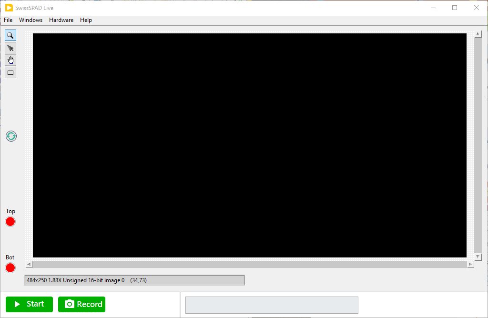
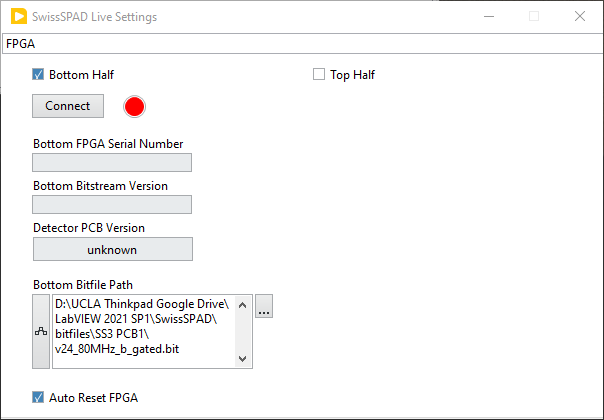
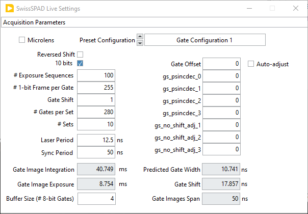
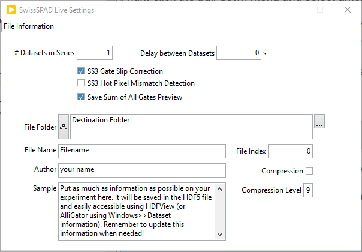
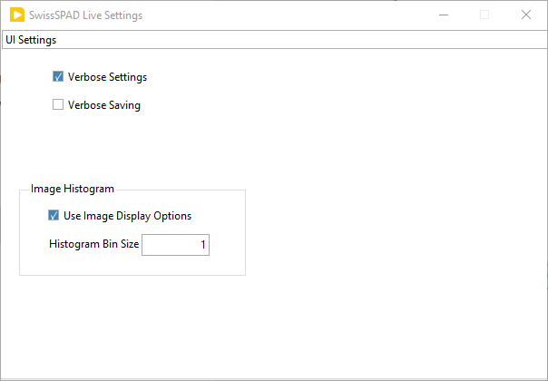
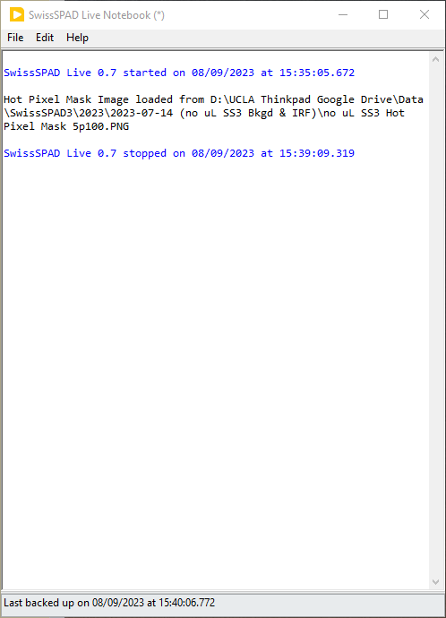
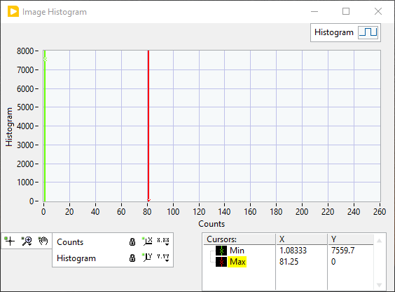
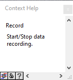
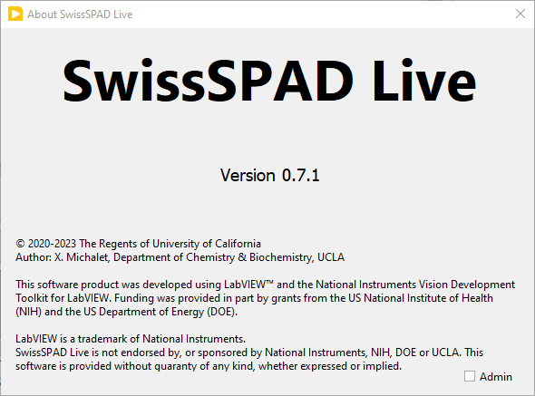

SwissSPAD Live Windows
======================

SwissSPAD Live is comprised of one main Window and 5 child windows accessible 
from the top ``Windows`` menu. These different windows are briefly described 
next. For further information, please check the User Guide.

.. _main-window:

Main Window
-----------

The main window displays the latest live or recorded image in the top part.

The top menu bar gives access to the following functions:

- File
	- Quit

- Windows
	- Settings (``Ctrl+E``)
	- Histogram (``Ctrl+M``)
	- Notebook (``Ctrl+N``)
	
- Help
	- Show Context Help (``Ctrl+H``)
	- FPGA Status
	- Reset FPGA
	- About

The center part displays the last processed image. This object is interactive 
(use the right-click menu to access the different functions). In particular, it 
is possible to zoom in (zoom tool + left click) and out (zoom tool + Shift + 
left click). The rectangular ROI can be used to defined which subregion of the 
detector to save data from (see Settings >> Image Information).

The bottom part contains the ``Start`` and ``Record`` buttons, as well as a 
``Message Box`` in which information on the current on-going task is displayed.

During processing, an animated busy icon appears to the right of the ``Record`` 
button. When acquiring data, user inputs are queued until the current task is 
completed (some requests such as opening windows are still processed).

During data saving, a blinking LED appears within the busy icon. This is a 
reminder that while data acquisition might have completed, asynchronous data 
saving is still taking place. To obtain information on this (or these) 
process(es), hover over the LED and check the information displayed in the 
:ref:`Context Help Window <context-help-window>`.

Right-clicking on the LED gives access to the ``Abort All Saving Tasks`` option.
 To use this 'nuclear' option, first stop the current recording task.

The main window is resizeable.

.. _settings-window:

Settings  Window
----------------

The Settings window is accessed via the ``Windows >> Settings`` menu item 
(shortcut: ``Ctrl+E``).

The window consists of several panels which can be accessed from the top 
pull-down selector: :ref:`FPGA <FPGA-tab>`, :ref:`Acquisition Parameters 
<acquisition-parameters-tab>`, :ref:`Image Parameters <image-parameters-tab>`, 
:ref:`File Information <file-information-tab>` and :ref:`UI Parameters 
<UI-parameters-tab>`.

.. _FPGA-tab:

FPGA
^^^^
 

The FPGA panel is used to specify which bitfile to upload to the FPGA (and 
therefore which task the detector can subsequently  perform) and establish 
initial connection with the FPGA.

+ ``Sensor Half``

  The first choice to make is which half of the sensor is used, by checking one
  of the two checkboxes at the top of the panel. In both SS2 & SS3, the two 
  halves of the sensor are read by their own FPGA. Currently SwissSPAD Live 
  supports reading either one of the two halves, but not both at the same time.
  
+ ``Connect to FPGA``

  The ``Connect`` button needs to be pressed to establish a connection with the 
  FPGA. If successful, the FPGA ``Serial Number``, ``Bitstream Version`` and 
  stored ``Detector PCB Version`` are displayed in the corresponding indicators.
  The latter information is stored in an editable file (FPGA Database.txt) 
  located in the ``bitfiles`` folder. This file stores S/N, type of detector 
  firmware and FPGA location. This information is used by SwissSPAD Live to pass
  the correct parameters to the firmware.
  It is critical to update this file only when a new FPGA is installed on a 
  detector or when a new detector is used.
  
+ ``Bitfile Path``

  Select which bitfile to use. The selected file needs to be designed for the 
  correct sensor (SS2 or SS3) and also for the correct half (conventionally
  referred to as "top" or "bottom"). Moreover, it should support the SYNC signal
  frequency that will be used during acquisition. Generally, the bitfile name 
  will specify which half ('b' or 't') and which frequency ('80MHz', '40MHz' or 
  '20MHz') it corresponds to.
  
  For SS2, there are two types of available bitfile for each FPGA: an 
  ``intensity`` bitfile and a "gated" one. The former ignores all gate settings 
  (see next panel description), keeping the gate open during the whole 1-bit 
  frame integration time, and is typically used for live mode imaging (e.g. for 
  focus adjustment).

  The latter is used for time-gated data acquisition. It can of course also be 
  used in live mode, but in that case, the gate position is fixed to the starting 
  value defined in the :ref:`Acquisition Parameters <acquisition-parameters-tab>` 
  panel.

  For SS3, a single bitfile is used for both modes, which are selected in the 
  :ref:`Acquisition Parameters <acquisition-parameters-tab>` panel (see below).

+ ``Auto Reset FPGA``

  Check the ``Auto Reset FPGA`` checkbox to let the software automatically reset
  the FPGA during acquisition in case of time out, and repeat the failed 
  recording.

.. _acquisition-parameters-tab:

Acquisition Parameters
^^^^^^^^^^^^^^^^^^^^^^

The Acquisition Parameters panel is used to specify gate parameters as well as 
the number of gates and their exposure, etc. Parameter values displayed on a
gray background are indicators (they cannot be modified by the user) and are 
updated automatically when the user modifies other parameters.

The Acquisition Parameters panel looks slightly differently for SS2 and SS3. 
Below is the typical aspect when using SS2:

Note in particular the pull-down ``Preset Configuration`` list allowing 
selection of one of the 7 predefined gate definitions.

The following shows the panel's aspect when using SS3:

.. image:: images/SS3-Live-Settings-Window-Acquisition-Parameters.PNG

Please check the :ref:`User Guide section <setting-acquisition-parameters>` for 
a detailed description of the different parameters.

.. _image-parameters-tab:

Image Parameters
^^^^^^^^^^^^^^^^

.. image:: images/SwissSPAD-Live-Settings-Window-Image-Parameters.PNG

The Image Parameters panel is used to specify whether or not:

- only a region of interest (ROI) of the frame is saved

- define the ROI (user defined by numerical values or as drawn on the main window image)

- data is binned before being saved

- the Bottom or Top FPGA data is shown

- the image histogram cursors are used to adjust the displayed image contrast

- to replace hot pixels by the median value of their neighbors (and set related 
  parameters accordingly)
  
In the case of SS3, an additional selector is shown (``SS3 Displayed Image``) 
allowing chosing what data is shown as displayed image.

Note that while using a ROI or binning the data results in smaller files, the 
data acquisition process still uses the full sensor frame, image cropping and 
binning occuring in software before data saving. In other words, the data 
acquisition time is independent of these settings. The additional data 
processing involved is usually minimal. However, data saving can be considerably
sped up, and the data footprint reduced accordingly.

Keep in mind that once cropped or binned, the original data cannot be recovered.

.. _file-information-tab:

File Information
^^^^^^^^^^^^^^^^

The File Information panel is used to define the file path, start index, etc. 
and additional information about the recorded data file(s), as detailed next.

- ``# Datasets in Series``: specifies the number of times the preset
  acquisition is repeated, one file being saved after each acquisition, its index
  starting at the current ``File Index`` value + 1 and being incremented by 1 for
  each new file.

- ``Delay between Datasets``: used to add a pause after 
  each dataset acquisition.

- ``Add Underscore Prefix``: used to easily identify
  SS2 dataset files which have been identifed as comprising data that was 
  scrambled during transfer from FPGA, or comprising less gates than requested.

- ``SS3 Gate Slip Correction``: used to check whether some typical pattern 
  occurring when data is lost during transfer from the FGPA to the PC is present. 
  The resulting gate images are 16 pixels shorter than usual (484 x 250 instead
  of 500 x 250).

- ``SS3 Hot Pixel Mismatch Detection``: used to check whether the location of 
  detected hot pixels in the recorded dataset match the stored locations. In 
  case of mismatch, the dataset is discarded.

- ``Save Sum of All Gates Preview``: saves a PNG image of both INT and G2 gate 
  sum images for rapid detection of data scrambling during transfer.

- ``File Folder``: specifies which folder the files are saved in. Use the 
  Browse button (3 dots) to the right to select the target folder.

- ``File  Name``: represents the root file name, to which ``_n.hdf5`` will be 
  added, where ``n`` is the value of ``File Index``, displayed as a 4-digit 
  number (zero-justified).

- ``Compression``: if checked, each time-gate image stored in the final HDF5 
  file is compressed using the zlib compression algorithm.

- ``Compression Level`` (0 - 9, default: 9): Compression adds to the data saving
  duration, but can reduce the final file size severalfold, depending on the 
  gate image complexity. In general, file saving starts becoming slower than 
  data acquisition for compression level 7 and above, while the additional file 
  size reduction is minimal.

- ``Author``, ``Sample``: recommende fields used to document the file.

.. _UI-parameters-tab:

UI Parameters
^^^^^^^^^^^^^

The UI Parameters panel is used to set:

- ``Verbose Settings``: turn on/off sending settings changes to the Notebook.

- ``Verbose Saving``: turn on/off sending additional information related to data
  transfer when saving datasets.

- Image Histogram

  + ``Use Image Display Options``: check this box to use the ``Image Display 
    Options`` defined on the *Image Parameters* panel to build the histogram. In 
    particular, if the ``Remove Hot Pixels`` option is selected, the histogram 
    will be calculated using the modified image, allowing a cleaner view of the
    useful distribution of pixel intensities in the dataset. This will however 
    increase processing time.

   + ``Histogram Bin Size``: bin size used for the image histogram. The default is
     1 and should generally be appropriate for most images.

.. _notebook-window:

Notebook
--------

The Notebook is a Rich Text Box object in which most actions performed by the 
software are recorded. It is accessed via the ``Windows >> Notebook`` menu item 
(shortcut: ``Ctrl+N``).

It can also be used to type in user comments, copy/paste text or graphics, etc. 
and in general is intended as a log of an experimental session.

The content of the Notebook can be saved (and re-opened within the Notebook) as
a rich text format (.rtf) file.
 
Tne Notebook is backed-up automatically every 5 min and in case of a crash, can 
be found in the C:\Users\username\AppData\Local\Temp folder (which is hidden by
default) under the name ~SwissSPAD Live Notebook n.rtf where n is a random 
number. The time of last backup is indicated at the bottom of the Notebook.

Note: :red:`It is strongly recommended to save the Not
ebook's content after each 
data acquisition session for reproducibility purposes.`

.. _histogram-window:

Histogram Window
----------------

The Histogram Window shows an histogram of the displayed image's pixel values. 
It is opened with the ``Windows >> Histogram`` menu item (shortcut: ``Ctrl+M``).
The bin size is defined in the Settings >> :ref:`UI Parameters <UI-parameters-tab>` 
panel.

If the ``Use Histogram Cursors for Contrast`` checkbox has been checked in the 
Settings >> :ref:`image-parameters-tab` panel, the cursors will be used to 
define the minimum and maximum values displayed using the selected color palette.

The Histogram window is resizable.

.. _context-help-window:

Context Help Window
-------------------

The Context Help window is a floating window and shows information (when 
available) about the object the mouse is over. It is shown or hidden using the 
``Help >> Show Context Help`` menu item (shortcut: ``Ctrl+H``).

In particular, it is used to display file saving progress when hovering over the 
``Saving in progress`` blinking LED showing up at the bottom of the main window
when datasets are being saved in the background.

.. _about-window:

About Window
------------

The About Window is a dialog window (it prevents other windows from being 
interacted with). Click anywhere in it to close it.
